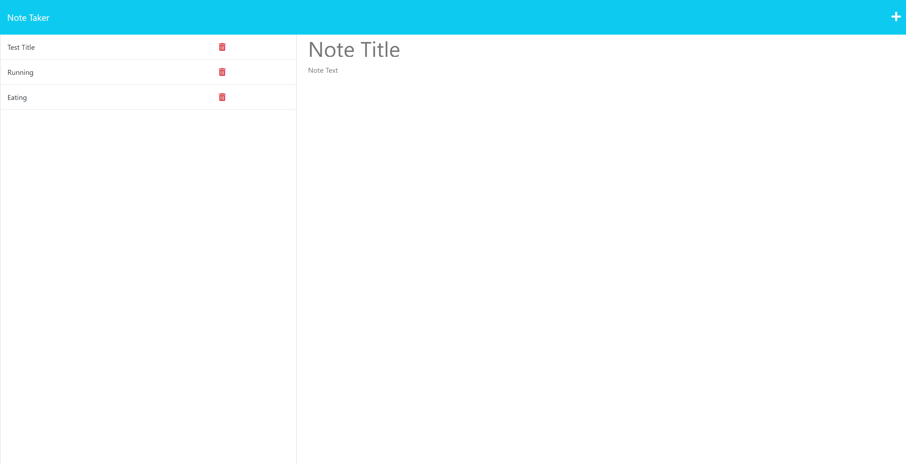

# Professional Note Taker
## Description
As a small humble developer, I want to write and save notes easily thoughout my day that is easily assessible and requires minimal effort. This application will utilize an Express.js back end and will save and retrieve note data from a JSON file. 

## Table of Contents
-[Installation](#installation)

-[Usage](#usage)

-[License](#license)

-[Contributing](#contributing)

-[Tests](#tests)

-[Questions](#questions)

## Installation
Installation of node.js is required to start the application. No further installation is required 

## Usage
Begin notes by starting the application. Application is initiated once the user enters 'npm install' to prep the application. Once npm is finished downloading, enter 'npm start' on the CLI and a link will appear corresponding to the application.

## License
None

## Questions
[github.com/dong135790](https://github.com/dong135790)

If further assistence is required, please send an email to the following below

dong135790@gmail.com
